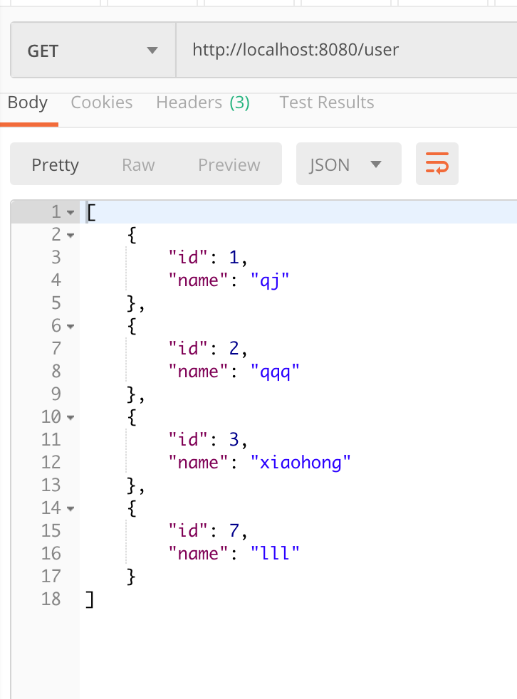

## MyBatis 基础练习
### 练习描述
- 编写UserMapper和UserController文件，完成所需接口，数据结构如下图所示
可使用postman对接口进行测试，如选择操作的结果为：

- 在本地数据库中创建名为user的数据库，创建user表，数据结构为上图所示，并在application.properties中修改相关配置。

### 环境描述
- java8
- Intellij-IDEA

### 如何开始
克隆模版库,在UserMapper文件中下完成需求
- 输出规范
- 完成需求的代码

### 结果
- 将增删改查的测试截图放在根目录的result文件中
